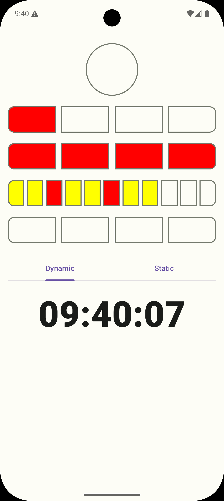
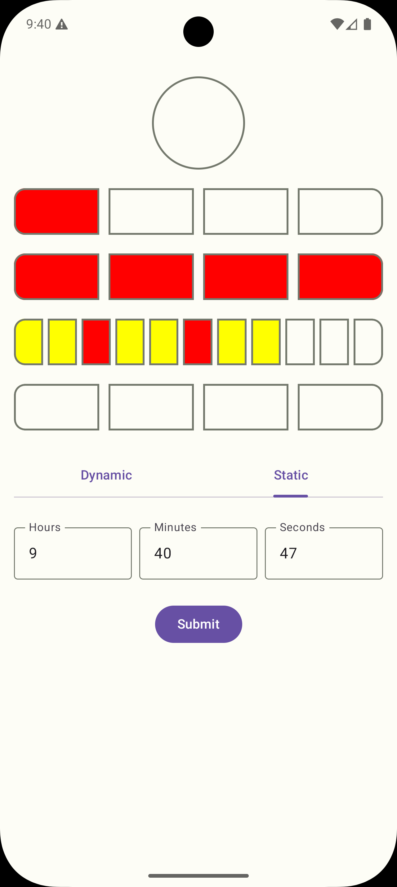

# Berlin Clock

An Android application that displays the current time as a **Berlin Clock** — the time is represented by rows of illuminated leds instead of
digits. Built with Jetpack Compose, Clean Architecture and a unidirectional data flow.

## Screenshots

| Dynamic                                                           | Static                                                  |
|-------------------------------------------------------------------|---------------------------------------------------------|
|  |  |

## What is the Berlin Clock?

The Berlin Clock encodes the time across five rows of leds:

| Row | Leds | Meaning                                                       |
|-----|------|---------------------------------------------------------------|
| Seconds | 1    | Lit on even seconds, off on odd seconds                       |
| Hours ÷ 5 | 4    | Each lit led = 5 hours                                        |
| Hours mod 5 | 4    | Each lit led = 1 hour                                         |
| Minutes ÷ 5 | 11   | Each lit led = 5 minutes (every 3rd led marks a quarter hour) |
| Minutes mod 5 | 4    | Each lit led = 1 minute                                       |

**Example — 13:17:00**

- Hours ÷ 5 → `13 / 5 = 2` → 2 leds lit
- Hours mod 5 → `13 % 5 = 3` → 3 leds lit  → 13 hours
- Minutes ÷ 5 → `17 / 5 = 3` → 3 leds lit
- Minutes mod 5 → `17 % 5 = 2` → 2 leds lit  → 17 minutes
- Seconds → `0` is even → led lit

The conversion logic lives in
[`ConvertTimeToBerlinClockUseCase`](app/src/main/java/com/example/berlinclock/domain/usecase/ConvertTimeToBerlinClockUseCase.kt).

## Features

The app runs on a **single screen** with two tabs:

1. **Dynamic** — shows the live system time and refreshes every second.
2. **Static** — lets you enter a time manually (hours `0–23`, minutes `0–59`,
   seconds `0–59`). Each field is validated and the **Submit** button is
   enabled only when all inputs are valid

The screen also handles **loading** and **error** states and supports both **light and
dark themes**. All UI lives in
[`BerlinClockScreen.kt`](app/src/main/java/com/example/berlinclock/presentation/ui/BerlinClockScreen.kt).

## Architecture

The project follows **Clean Architecture** with a clear separation between business
logic and UI, and a unidirectional data flow (state flows down, events flow up).

```
com.example.berlinclock
├─ domain/                      
│  ├─ model/
│  │  ├─ BerlinClock.kt         
│  │  └─ Time.kt                
│  ├─ repository/
│  │  └─ TimeRepository.kt      
│  └─ usecase/
│     ├─ GetTimeUseCase.kt     
│     └─ ConvertTimeToBerlinClockUseCase.kt  
├─ data/
│  └─ repository/
│     └─ LocalTimeRepositoryImpl.kt           
├─ presentation/
│  ├─ viewmodel/BerlinClockViewModel.kt       
│  ├─ ui/BerlinClockScreen.kt                 
│  └─ ui/theme/                               
├─ di/AppModule.kt              
└─ BerlinClockApplication.kt    
```

- **UseCases** encapsulate the rules.
- **ViewModel** exposes a single immutable `State` (`NotInitialized`, `Loading`,
  `Content`, `Error`) and receives events (`onDynamicTabClick`, `onStaticTabClick`,
  `onSubmitStaticTimeClick`).
- **Dependency injection** is handled with **Koin** for this small project instead of Dagger/hilt
  ([`AppModule.kt`](app/src/main/java/com/example/berlinclock/di/AppModule.kt)) 

### Design note: a led is on or off — color is UI only

The domain model represents each led as a `Boolean` (turn on / turn off). **led colors
(red, yellow) are purely a presentation concern** assigned in the Composable layer, not
in the domain. This keeps the business rules independent of how the clock looks.

### The ticking pattern

The ViewModel combines three flows — the selected `mode`, the `staticTime`, and a 1-second
`clockTick` — and exposes the result with
`stateIn(viewModelScope, SharingStarted.WhileSubscribed(5_000), State.NotInitialized)`.
Keeping the ticker inside `WhileSubscribed` means it only runs while the UI is actually
observing, and stops shortly after the screen goes away. See
[`BerlinClockViewModel.kt`](app/src/main/java/com/example/berlinclock/presentation/viewmodel/BerlinClockViewModel.kt).

## Testing

The project is covered by **unit tests** focused on the critical logic:

### Note about the approach (TDD)

The Berlin Clock is a classic **Test-Driven Development** kata, and the critical business
logic was driven from tests: the conversion use case and the ViewModel were grown with
their unit tests (the commit history reflects red/green iterations). The conversion logic
in particular — the part most worth getting right — is exhaustively covered.

## Dependencies

Dependencies are managed centrally through the Gradle version catalog
([`gradle/libs.versions.toml`](gradle/libs.versions.toml)).

## Build & run

Standard Gradle tasks, from Android Studio or the command line:

```bash
# Build the debug APK
./gradlew assembleDebug

# Run the unit tests (JUnit 5)
./gradlew test

# Build everything (compile + tests)
./gradlew build
```

